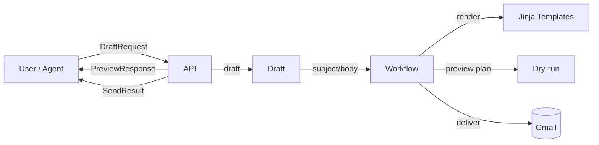

Mail Agent Tools

Overview
- Compose, iterate, render, and deliver branded emails via a simple API or as a sub‑agent/tool. Users preview a draft, request changes in natural language, and approve for drafting/sending via Gmail.

Architecture
- Layers:
  - Web API (FastAPI): endpoints for draft/preview/deliver and iteration.
  - Drafting (DraftAgent): deterministic subject/body seed.
  - Rendering (Jinja + Premailer): HTML + plaintext, brand aware.
  - Workflow: orchestrates draft → render → preview/deliver.
  - Gmail Ops: OAuth, MIME, labels, draft/send.
  - ADK Agent: tools to use this API in `adk web`.



Agentic Flow
1) Gather recipient, purpose, brand (default `default`).
2) Preview first; show subject + readable text body + plan.
3) Iterate via structured fields or NL (e.g., “add bullets: …”, “tone: warm”, “remove CTA”).
4) Approve → choose Draft or Send. Delivery applies labels `<prefix>/<brand>`.

Tech Stack
- Python 3.12, FastAPI, Pydantic v2, Jinja2, Premailer, BeautifulSoup
- Gmail API (google‑api‑python‑client), OAuth (google‑auth‑oauthlib)
- ADK (google‑adk) to run in `adk web`
- Tests: Pytest, httpx ASGI, Syrupy snapshot

Setup
1) Python env
   - `python -m venv .venv && . .venv/bin/activate`
   - `pip install -r requirements.txt`
2) Configure environment
   - Copy `.env.example` → `.env` and set values (API keys, gmail files).
   - Place Gmail OAuth client JSON at `.secrets/google/credentials.json`.
3) First run (dev)
   - `uvicorn app.web.app:app --reload --port 8080`

Gmail Auth (once)
- Run interactive flow to create/update the token with needed scopes:
  - `.venv/bin/python -c "from app.google.oauth import ensure_user_credentials as e; e(interactive=True)"`

Using ADK Web
- Terminal 1: `uvicorn app.web.app:app --reload --port 8080`
- Terminal 2:
  - `export MAIL_API_BASE=http://localhost:8080`
  - `adk web`
- Start a session: ask for a welcome email, iterate with NL, then approve (Draft or Send).

CLI Usage
```bash
python -m app.cli preview --to pat@example.com --name Pat \
  --purpose welcome --brand default \
  --context '{"cta_text":"Visit CodeRoad","cta_url":"https://coderoad.com/"}'

python -m app.cli deliver --to pat@example.com --name Pat --purpose welcome --brand default
```

API Examples
- Preview:
```bash
curl -s http://localhost:8080/mail/preview -H 'content-type: application/json' \
  --data '{"recipient":{"email":"pat@example.com","name":"Pat"},"purpose":"welcome","brand_id":"default","context":{}}'
```
- Iterate (NL):
```bash
curl -s http://localhost:8080/draft/iterate/nl -H 'content-type: application/json' \
  --data '{"base": {"recipient":{"email":"pat@example.com","name":"Pat"},"purpose":"welcome","brand_id":"default"}, "updates": {"instructions": "tone: warm; add bullets: Explore docs; Book a demo"}}'
```
- Deliver (draft):
```bash
curl -s "http://localhost:8080/mail/deliver?mode=draft" -H 'content-type: application/json' \
  --data '{"recipient":{"email":"pat@example.com","name":"Pat"},"purpose":"welcome","brand_id":"default","context":{}}'
```

Configuration
- `.env` keys:
  - `GOOGLE_OAUTH_USER_FILE` (.secrets/google/token.json)
  - `GOOGLE_OAUTH_CLIENT_FILE` (.secrets/google/credentials.json)
  - `MAIL_AGENT_DEFAULT_ACTION` (draft|send)
  - `MAIL_AGENT_GMAIL_LABEL_PREFIX` (default: Agent‑Sent)
  - `MAIL_AGENT_BRAND_ID` (default: default)


